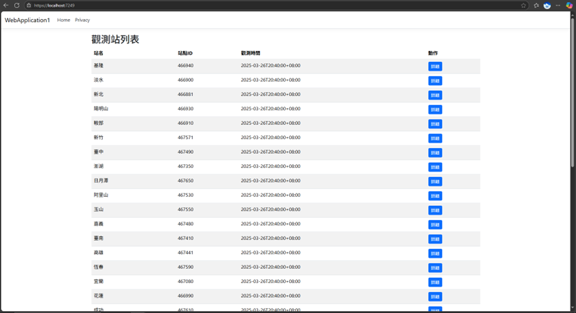
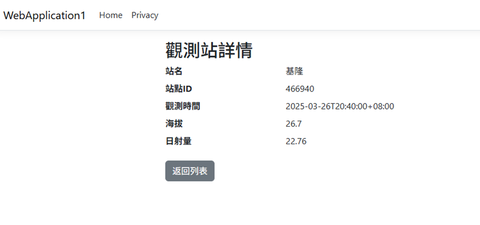

此專案為 ASP.NET Core MVC 網站，提供署屬氣象站日射量資料的展示、上傳與報表功能。

遇到的問題與解決方式
問題	
JSON 格式為巢狀物件，難以反序列化
解決方式
使用 Newtonsoft.Json 搭配自訂 C# 類別對應結構
問題	
Controller 與 Razor 頁面資料繫結不熟悉
解決方式
參考官方文件與 MVC 教學練習
問題	
資料不會保留在記憶體外
解決方式
將資料儲存在 Singleton Service 層中
