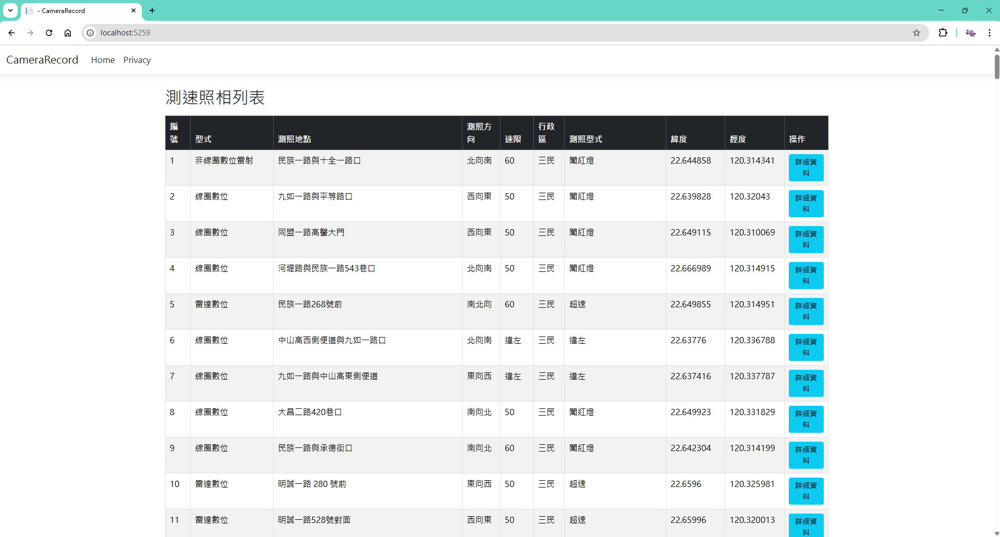
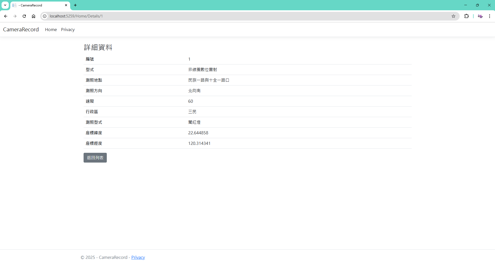
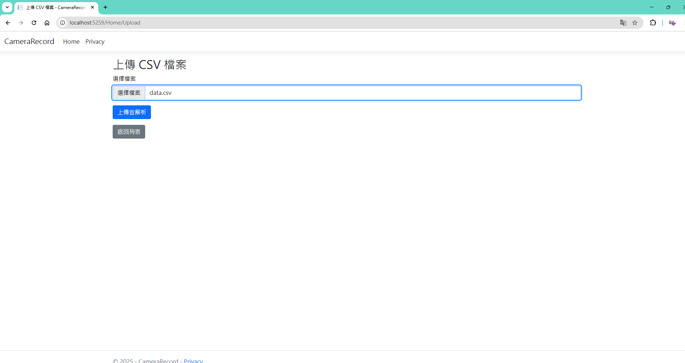
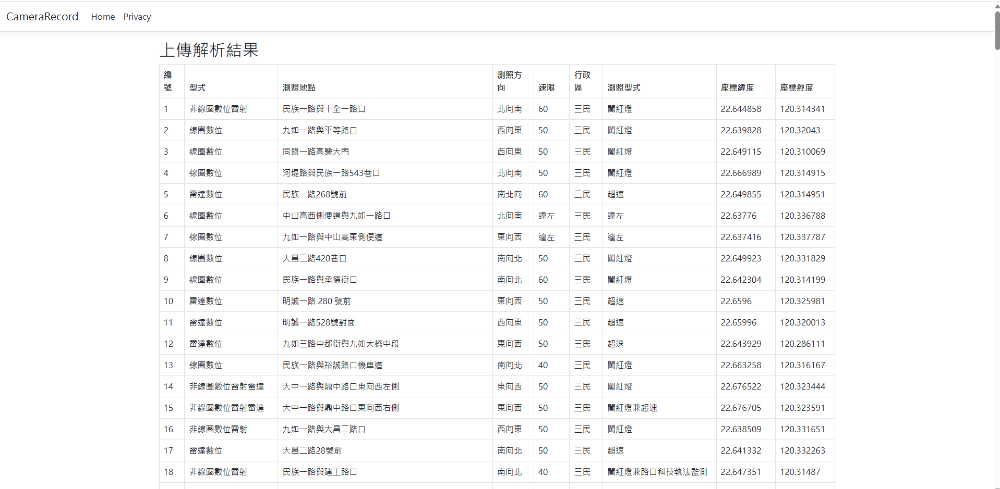

## 專案概述

這是一個使用 ASP.NET Core Web 應用程式來顯示和管理測速照相機位置資料的系統。資料來自一個 CSV 檔案，並提供資料列表、詳細資訊頁面、檔案上傳功能和報表頁面。

## 功能

1. **資料列表頁面**：顯示所有測速照相機位置。

2. **詳細資訊頁面**：顯示單筆測速照相機位置的詳細資料。

3. **檔案上傳**：允許用戶上傳新的 CSV 檔案並解析。

4. **報表頁面**：生成並顯示測速照相機資料的統計報表。

