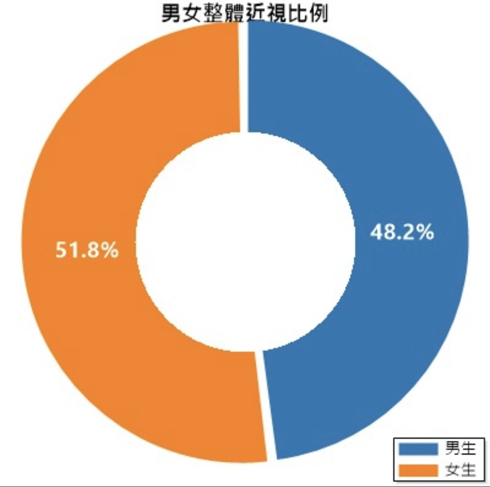
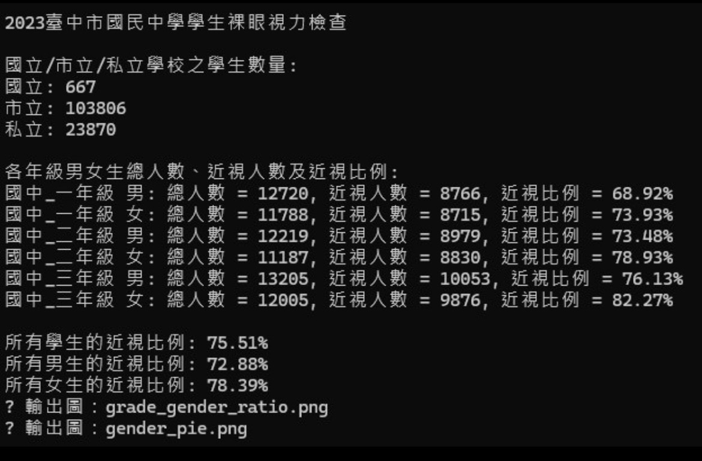

# 學生視力資料視覺化系統

## 資料來源
- 臺中市 2023 年國民中學視力檢查統計資料
- 國立 / 市立 / 私立國中學生總數與各年級分性別統計
- 台灣政府開放資料平台：https://data.gov.tw

## 程式主要功能
本程式使用 C# 與 ScottPlot 套件製作視力資料視覺化工具，主要功能如下：

- 顯示各年級/班級視力統計圖表
- 比較左眼與右眼視力分布差異
- 動態篩選指定班級或年級的學生視力資訊
- 匯出圖表為圖片檔

## 使用套件
- [ScottPlot 4.x](https://scottplot.net/)：用於繪製視覺化圖表
- System.IO：讀取 CSV 檔案
- System.Windows.Forms：提供基本視窗介面與表單操作

## 程式截圖

## ▶️ 如何執行

### 1. 編譯程式
請使用 Visual Studio 2022 或以上版本開啟 `1011.sln` 解決方案檔，並確保已還原 NuGet 套件後即可進行編譯。

### 2. 執行程式
執行主表單後，使用者可以透過「匯入資料」功能載入 CSV 視力資料，系統將自動產生視覺化圖表。

### 3. 注意事項
- 請將圖片資料放在 `images/` 資料夾下，否則 Markdown 中的圖片無法顯示。
- 若無法正常顯示圖表，請確認 ScottPlot 套件版本是否正確為 4.x。
