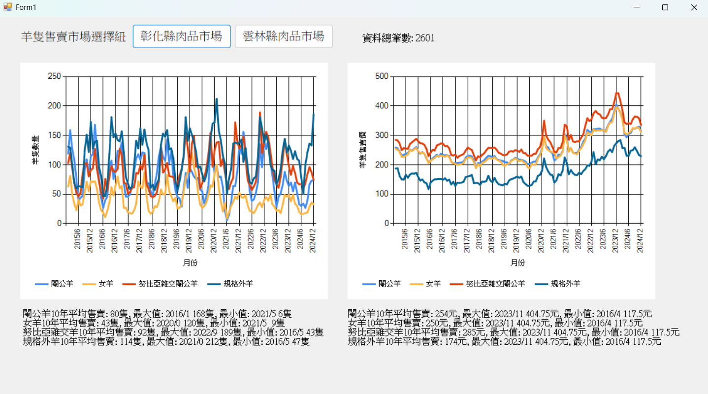
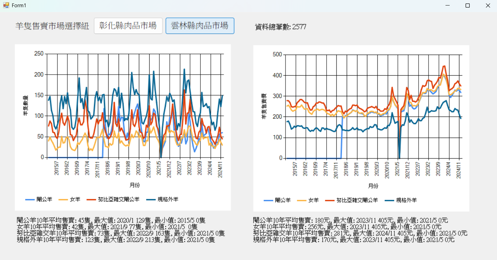

# 羊隻資料分析系統 - 彰化縣 & 雲林縣

## 簡介

使用 **C# Windows Forms** 來分析來自雲林縣與彰化縣的羊隻銷售資料，並依照不同羊隻類別（如閹公羊、女羊、努比亞雜交羊、規格外羊）呈現2015~2024年售賣數量與價格的統計圖表。

## 資料來源

- 羊隻數據來自台灣政府開放資料平台 https://data.gov.tw/dataset/17327
- 匯入格式為 CSV，先前經處理轉為 C# 物件

---

## 功能

1. 顯示四類羊隻(閹公羊、女羊、努比亞雜交閹公羊、規格外羊)10年間每月平均售賣數量與價格變化折線圖
2. 顯示10年平均、最大、最小統計值以及年月分
3. 可以選擇資料來源地(雲林、彰化)，並顯示該地10年內的總資料筆數

---

## 使用的套件與命名空間

| 命名空間 | 用途說明 |
|----------|----------|
| `System` | 提供基本類型、數學函式與全域支援（如 `Math.Round`, `String` 等） |
| `System.Collections.Generic` | 使用泛型集合，如 `List<T>` 儲存數據 |
| `System.Text` | 處理文字編碼，這裡用於讀取 Big5 編碼的 CSV 檔案 |
| `System.IO` | 用於檔案讀取操作（例如 `File.ReadAllText`） |
| `Microsoft.VisualBasic.FileIO` | 使用 `TextFieldParser` 解析 CSV 資料 |
| `System.Windows.Forms` | 建立與啟動 Windows Forms 視窗應用程式 |
| `WindowsFormsApp1` | 專案本身的命名空間，呼叫 `Form1` 顯示 UI |

---

## 使用方式

1. 使用 Visual Studio 開啟此專案
2. 點選「啟動」或按 `Ctrl + F5` 執行
3. 程式會載入資料並自動繪製折線圖表  
   - 折線圖一：顯示各類羊隻每月平均**數量**，下方顯示其平均值、最大值、最小值相關資料
   - 折線圖二：顯示各類羊隻每月平均**價格**，下方顯示其平均值、最大值、最小值相關資料
4. 可利用按鈕切換查看縣市，按鈕右側將顯示該地區資料統計總筆數

---

## 作者

- 四子三丙 C111152301 李姿萱 