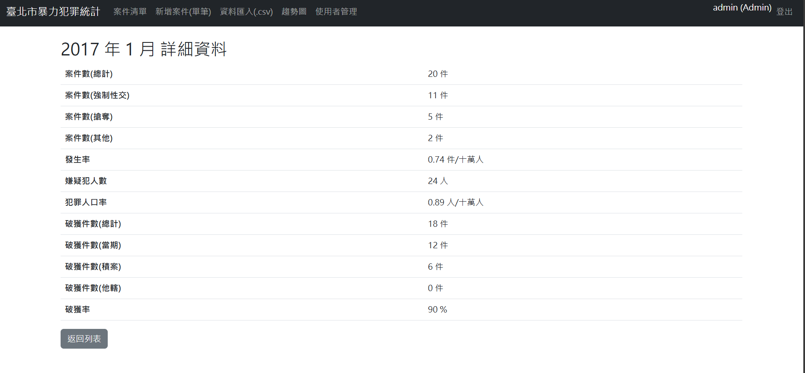
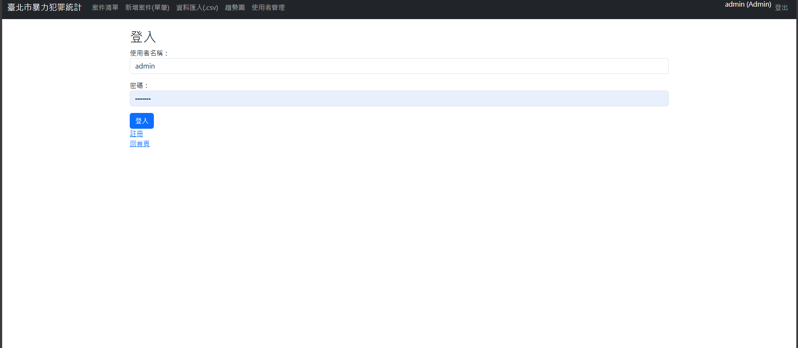
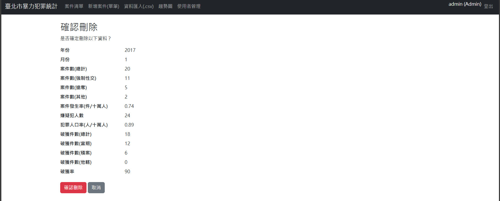
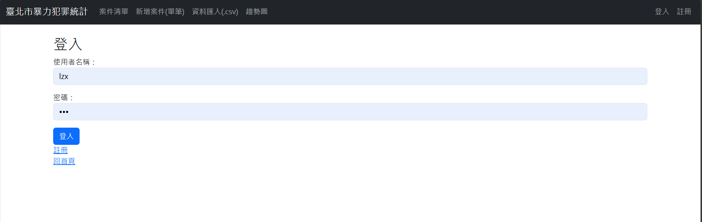
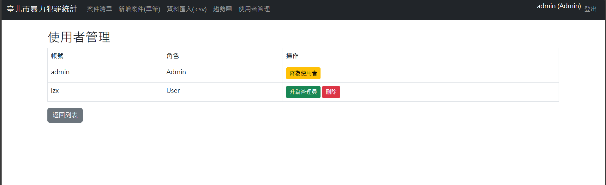

# 臺北市暴力犯罪案件資料管理系統

## 專案整體架構說明

- **Controllers/**：處理網頁請求與導向邏輯（CRUD、報表等）
- **Models/**：資料模型類別（CrimeStat、UserAccount）
- **Views/**：Razor 頁面，搭配 Bootstrap 呈現表單、清單與圖表
- **Data/**：資料庫上下文 `ApplicationDbContext.cs`，使用 SQLite
- **Services/**：包含 CsvService，負責匯入與轉換資料格式
- **Migrations/**：Entity Framework 自動建立的資料表版本紀錄

## 資料集

- 臺北市暴力犯罪案件按月別
- 網址: https://data.gov.tw/dataset/131024

## 功能

- 使用 SQLite 儲存資料
- 有登入系統及權限管理（訪客 / 使用者 / 管理員）
- 訪客只能查看詳細資料和搜尋、篩選、排序資料以及查看趨勢圖，登入後可新增資料，管理員可修改資料與刪除
- 可單筆新增資料或以.csv檔案匯入
- 可依不同條件排序、搜尋資料
- 可分頁顯示資料
- 以 Chart.js 依時間顯示個案件的趨勢圖(折線圖)

## 預設帳號

| 帳號  | 密碼     | 角色      |
|-------|----------|-----------|
| admin | admin123 | 管理員    |

## 執行畫面截圖

### 資料列表頁面
首頁顯示犯罪案件清單、分頁功能、條件篩選（年、月、類型）及排序

- 訪客/使用者資料顯示畫面

- 管理者資料顯示畫面

- 條件篩選、排序選項


### 資料詳細資訊頁面
點選「詳細」可查看該筆資料所有欄位，包括發生率、破獲數與犯罪人口率等

- 詳細資料頁面


### 資料上傳頁面
點選「新增案件(單筆)」和「資料匯入(.csv)」可上傳單筆和 `.csv` 資料（僅登入使用者、管理員可上傳）

- 未登入點擊會跳至登入頁面

- 單筆資料上傳

- 以.csv檔匯入資料，上傳後將顯示新增資料數


### 資料修改頁面（僅管理員可見）
點選「編輯」可編輯單筆資料內容並儲存

- 修改資料頁面


### 資料刪除頁面（僅管理員可見）
點選「刪除」可編輯單筆資料內容並儲存

- 會先跳出確認頁面


- 確認後將跳出欲刪除資訊頁面，再次確認後將刪除


### 趨勢圖報表頁面
點選「趨勢圖」將以 Chart.js 顯示各類型案件在不同年月的趨勢

- 趨勢圖頁面


### 註冊頁面
點選「註冊」可註冊帳號為使用者

- 註冊頁面


### 登入頁面
點選「登入」可以帳號登入增加使用功能

- 登入頁面


### 帳號管理頁面（僅管理員可見）
點選「使用者管理」管理員可刪除使用者或提升、降低權限

- 帳號管理權限頁面


## ⚙️ 詳細的執行步驟

1. 安裝 [.NET 9 SDK](https://dotnet.microsoft.com/)
2. 還原套件：
   ```bash
   dotnet restore
3. 建立資料庫（任選一種）：

    - 使用 EF Core 指令：

    ```bash
    dotnet ef database update
    - 使用 SQL 指令檔建立：

    ```bash
    sqlite3 crime.db < CrimeStatsSchema.sql
4. 執行專案：

    ```bash
    dotnet run
5. 瀏覽 https://localhost:xxxx/ 使用網頁功能

## 已完成功能對照需求

| 功能項目 | 狀態 |
|----------|------|
| 匯入犯罪統計 CSV 檔案 | ✔ |
| 顯示資料清單並可搜尋、篩選、排序 | ✔ |
| 支援年＋月＋類型條件查詢與保留 | ✔ |
| 資料詳細頁面顯示完整欄位 | ✔ |
| 分頁顯示資料（每頁 10 筆） | ✔ |
| Chart.js 趨勢圖表 | ✔ |
| 登入系統：訪客／使用者／管理員 | ✔ |
| 匯入需登入、刪除需管理員權限 | ✔ |

## 遇到的問題與解法：

| 問題 | 解決方式 |
|------|-----------|
|SQLite 找不到 Table／Migration 問題 | 明確執行 `dotnet ef migrations add` |
| CSV 中文欄位無法對應模型欄位 | 使用 CsvHelper 並設置 Header 對應 |
| CsvHelper 匯入欄位不符合模型 | 加入欄位對應中文 Header 與型別轉換處理 |
| Razor 無法在 `<option>` 中寫 C# | 改寫成先宣告變數，再使用 `selected="..."` 屬性 |
| `Request.Query` 無法使用 | 改用 `ViewContext.HttpContext.Request` |
| Razor 找不到 `Request` | 改用 `ViewContext.HttpContext.Request.Query[...]` |
| Chart 畫面出現 null 錯誤 | 加入 `?? new List<T>()` 預設值避免空值 |
| 未註冊 `IHttpContextAccessor` | 在 `Program.cs` 加上 `AddHttpContextAccessor()` |